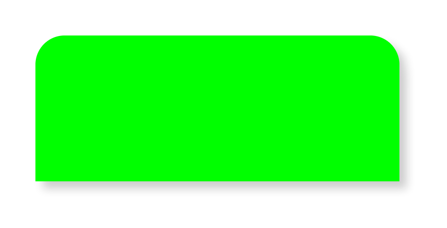

Example of a view that has rounded corners and a shadow. It uses the
maskedCorners property of CALayer, which is new in iOS 11.

Note that we use the raw value of CACornerMask to create a UIRectCorner. It'll
probably go okay in the future. Probably.

Example:

